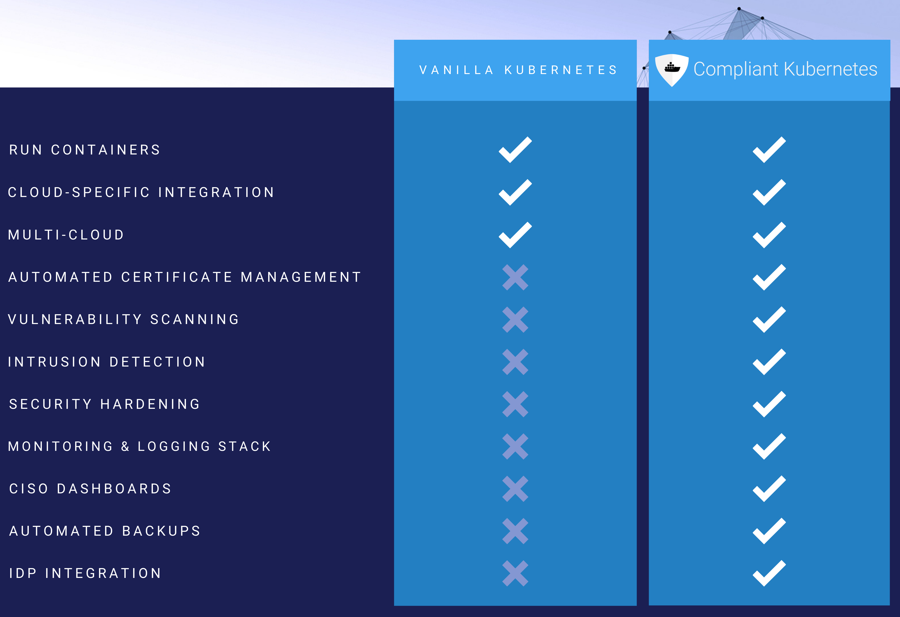

# Welcome to Compliant Kubernetes

Compliant Kubernetes is a [Certified Kubernetes](https://landscape.cncf.io/organization=elastisys&selected=elastisys-compliant-kubernetes) distribution, i.e., an opinionated way of packaging and configuring Kubernetes together with other projects. Compliant Kubernetes reduces the compliance burden, as required to comply with:

* [Health Insurance Portability and Accountability Act (HIPAA)](https://elastisys.com/hipaa-compliance-kubernetes-privacy-rule/)
* [Swedish Healthcare (Patientdatalagen)](https://elastisys.com/how-to-use-kubernetes-in-swedish-healthcare/)
* General Data Protection Regulation (GDPR)
* Payment Card Industry Data Security Standard (PCI DSS)
* Finansinspektionen's Regulatory Code (e.g., FFFS 2014:7)
* Other regulations that map to information security standards, such as ISO 27001

## Why Compliant Kubernetes?

Kubernetes has established itself as a go-to solution for high development velocity without vendor lock-in. However, vanilla Kubernetes is not usable in regulated industry, since it is [not secure by default, nor by itself](https://searchitoperations.techtarget.com/news/252487963/Kubernetes-security-defaults-prompt-upstream-dilemma). Therefore, if you want to benefit from the speed of cloud native development in regulated industries, Kubernetes needs to be carefully configured. Furthermore, Kubernetes is a laser-focused project ("Make each program do one thing well."), so it needs to be complemented with other cloud native projects.

Compliant Kubernetes fills this gap.
